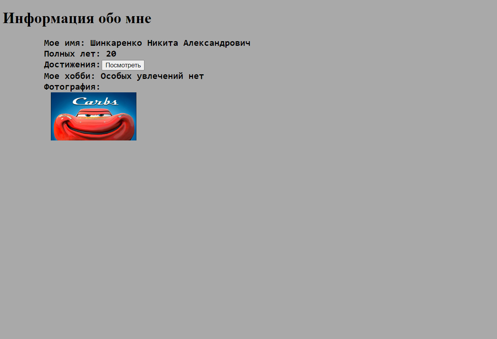

<p align = "center">МИНИСТЕРСТВО НАУКИ И ВЫСШЕГО ОБРАЗОВАНИЯ<br>
РОССИЙСКОЙ ФЕДЕРАЦИИ<br>
ФЕДЕРАЛЬНОЕ ГОСУДАРСТВЕННОЕ БЮДЖЕТНОЕ<br>
ОБРАЗОВАТЕЛЬНОЕ УЧРЕЖДЕНИЕ ВЫСШЕГО ОБРАЗОВАНИЯ<br>
«САХАЛИНСКИЙ ГОСУДАРСТВЕННЫЙ УНИВЕРСИТЕТ»</p>
<br><br><br><br><br><br>
<p align = "center">Институт естественных наук и техносферной безопасности<br>Кафедра информатики<br>Шинкаренко Никита Александрович</p>
<br><br><br>
<p align = "center"><br><strong>Лабораторная работа №1.«Введение вэб-разработку»</strong><br>01.03.02 Прикладная математика и информатика</p>
<br><br><br><br><br><br><br><br><br><br><br><br>
<p align = "right">Научный руководитель<br>
Соболев Евгений Игоревич</p>
<br><br><br>
<p align = "center">г. Южно-Сахалинск<br>2024 г.</p>
<br><br><br><br><br><br><br><br><br><br><br><br>

<h1 align = "center">Введение</h1>

<p><b>HTML</b> — стандартизированный язык гипертекстовой разметки документов для просмотра веб-страниц в браузере. Веб-браузеры получают HTML документ от сервера по протоколам HTTP/HTTPS или открывают с локального диска, далее интерпретируют код в интерфейс, который будет отображаться на экране монитора.</p>


<br>
<h1 align = "center">Цели и задачи</h1>


<p>Создание сайта с информацией обо мне.</p>

<p>ФУНКЦИОНАЛЬНЫЕ ТРЕБОВАНИЯ</p>
<ul>
<li>Наличие фотографии</li>
<li>Отображение информации обо мне: Имя, Возраст, Достижения,Хобби</li>
<li>Вся информация о персонажах задаётся внутри программы</li>
</ul>

<p></p>


<h1 align = "center">Решение</h1>

<p>Для выполнения этой лабораторной работы, я пользовался:</p>

<ul>
<li>Материалом в сети интернет</li>
</ul>

<h2 align = "center">index.html</h2>

```kotlin
<!DOCTYPE html>
<html lang="en">
<head>
    <meta charset="UTF-8">
    <meta name="viewport" content="width=device-width, initial-scale=1.0">
    <title>Document</title>
    <link rel="icon" type="image/x-icon"href="ic.icon">
</head>
<style>
    .gifka{
        margin-left: "-20px";
        margin-bottom: "-5px";
    }
    .baton{
        opacity: 1
    }
    .baton:disabled {opacity: 0;}
</style>
<body style="background-color: darkgrey;">
    <h1> Информация обо мне </h1>
    <h2>
        <pre>
        Мое имя: Шинкаренко Никита Александрович 
        Полных лет: 20
        Достижения:   <button id="bat" class="baton" onclick="dis()" style="margin-left: -30px;">Посмотреть</button>
        Мое хобби: Особых увлечений нет
        Фотография: <div ></div>
        </pre>     
    </h2>
    <script>
        function dis(){
            bat.disabled=true;
            document.getElementById("gif").style.display = "inline";
        }
    </script>
</body>
</html>
```


<h1 align = "center">Результат</h1>

<p align = "center"></p>

<h1 align = "center">Вывод</h1>
<p>По итогу проделанной лабораторной работы, я создал свой первый сайт.</p>
